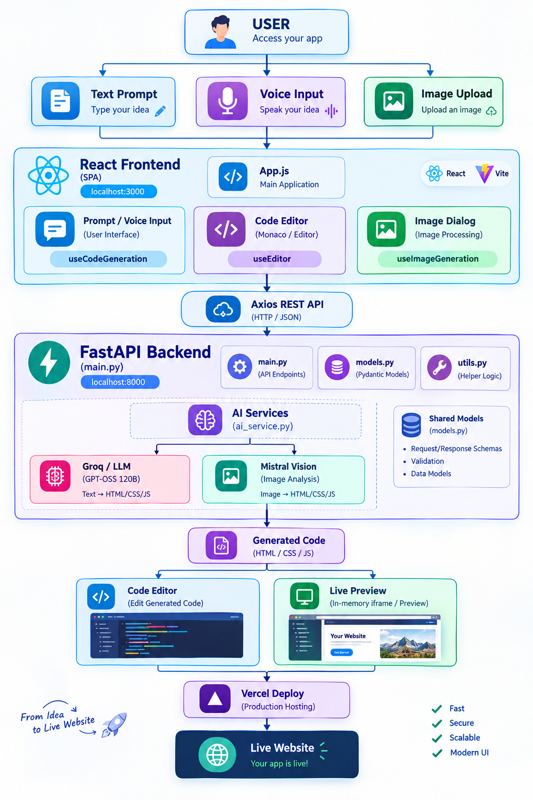
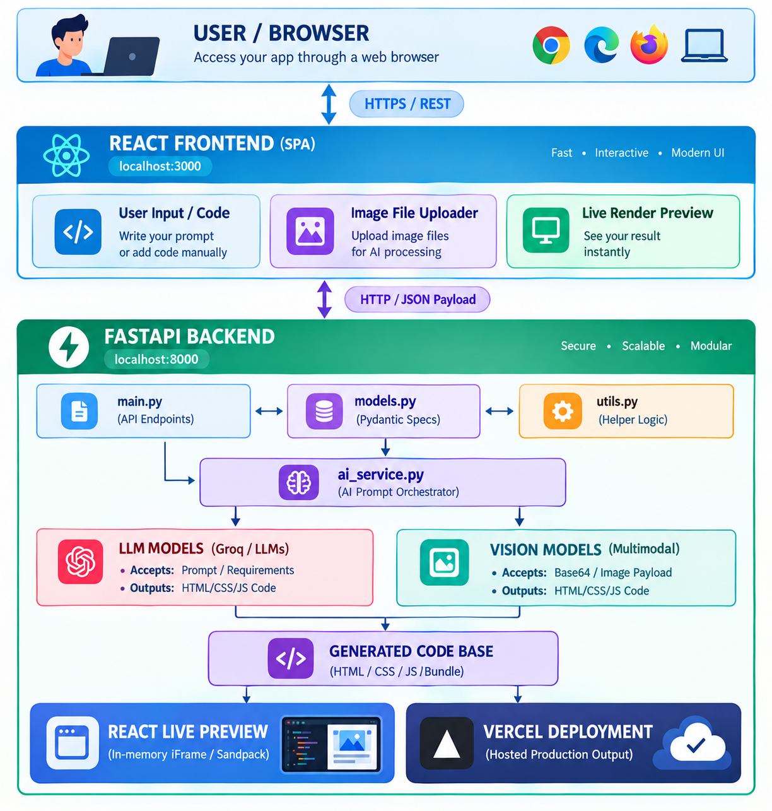

<p align="center">
  
</p>


<p align="center">

    
  
  
  
  

</p>

---

<h1 align="center"> AI Code Generator – Backend </h1>

AI Code Generator is an AI-powered web development platform that allows users to create complete websites using simple natural-language prompts.  
Users can generate, edit, preview, modify, and deploy websites without writing everything manually.

**Author:** [Gajanan Deshmukh](https://github.com/Gajanand1219)

---

## Demo

### Trailer

<p align="center">
  <video src="https://github.com/user-attachments/assets/ac3a4220-288c-4f6b-a982-ba9e05d713a8" controls width="100%"></video>
</p>

<!-- ### Full Demo

<p align="center">
  <a href="https://www.youtube.com/watch?v=c5lHsIUL8rM" target="_blank">
    
  </a>
</p>

> Click the thumbnail above to watch the full demo on YouTube. -->

---

##  Project Architecture   (Click images)


<table>
  <tr>
    <td align="center">
      <a href="../Project_design.png">
        
      </a>
      <br>
      <b>Complete Architecture</b>
    </td>
    <td align="center">
      <a href="./Project_design.png">
        
      </a>
      <br>
      <b>Backend Architecture</b>
    </td>
    <td align="center">
      <a href="../frontend/my-app/Project_design.png">
        
      </a>
      <br>
      <b>Frontend Architecture</b>
    </td>
  </tr>
</table>

| Layer | Components | Responsibility |
|-------|------------|----------------|
| **Frontend** | React, Monaco Editor, Voice & Image Input | UI, code editing and live preview |
| **AI Engine** | Groq, GPT-OSS 120B, Mistral Vision | Code generation, modification, debugging and vision |
| **Backend & API** | FastAPI, Pydantic, REST APIs | API handling, AI orchestration and sessions |
| **Code Processing** | HTML, CSS, JS Processing | Code extraction, validation and preview preparation |
| **Deployment** | Vercel | Automated website deployment and live URLs |


---


##  Features

-  **AI-Powered Website Generation**: Create modern websites and components using natural language prompts.
-  **Voice-to-Code**: Describe your ideas using voice and generate website code effortlessly.
-  **Image-to-Website**: Upload UI screenshots or images and transform them into functional website layouts.
-  **Live Code Editor & Preview**: Edit generated code and see real-time website previews in an interactive.
-  **AI Code Assistant**: Modify, debug, refactor, analyze, and optimize code using AI-powered assistance.
-  **Project Management & Deployment**: Save and manage projects, then deploy generated websites to Vercel. Deploy generated websites to Vercel

---


##  Installation & Setup

Follow these steps to get the project running locally:
### 1. Clone

```bash
# git clone https://github.com/thepradip/SQL-AI-Agent.git
cd code_assicent
``` 

### 2. Backend Setup (Python)

1.  **Navigate to the backend directory**:
    ```powershell
    cd backend
    ```

2.  **Create a virtual environment**:
    ```powershell
    python -m venv venv
    ```

3.  **Activate the virtual environment**:
    ```powershell
    venv\Scripts\activate
    ```

4.  **Install dependencies**: > The first installation may take some time.
    ```powershell
    pip install -r requirements.txt
    python.exe -m pip install --upgrade pip
    ```
   

5.  **Environment Variables**:
    Ensure you have a `.env` file in the `backend/` 
 (*All ready Api Key Set*)   

6.  **Run the server**:
    ```powershell
    uvicorn main:app --reload
    ```

### 3. Frontend Setup (React)

1.  **Navigate to the frontend directory**:
    ```powershell
    cd frontend/my-app
    ```

2.  **Install dependencies**:
    ```powershell
    npm install
    ```

3.  **Start the development server**:
    ```powershell
    npm start
    ```

The application will typically be available at `http://localhost:3000`.

---

## ! Problem Statement

Building a complete website from scratch can be time-consuming and requires knowledge of HTML, CSS, JavaScript, responsive design, debugging, and deployment.

Developers and beginners often face challenges such as:

-  Spending too much time writing repetitive frontend code
-  Requiring strong technical knowledge to build websites
-  Finding and fixing frontend bugs manually
-  Converting ideas or UI designs into working websites
-  Making multiple changes and improvements manually
-  Implementing responsive designs for different devices
-  Deploying the final website requires additional steps

Traditional development requires users to move between different tools for coding, testing, debugging, and deployment.

---

##  Solution

**AI Code Generator** provides an AI-powered development environment that combines website generation, code editing, live preview, modification, and deployment in one platform.

Users can simply describe what they want in natural language, and the AI generates a functional website automatically.

###  The platform provides:

-  **AI Website Generation** — Create complete websites from simple prompts.
-  **Voice-to-Code** — Generate websites using voice instructions.
-  **Image-to-Website** — Convert website screenshots into working code.
-  **AI Code Modification** — Modify existing websites using natural-language instructions.
-  **AI Debugging** — Detect and fix problems in generated code.
-  **AI Refactoring** — Improve code structure and maintainability.
-  **Live Code Editor** — Edit generated HTML, CSS, and JavaScript directly.
-  **Live Preview** — See website changes instantly while developing.
-  **Project Management** — Save, load, and manage generated projects.
-  **One-Click Deployment** — Deploy generated websites to Vercel.

---

##  Usage

1. **Enter a Prompt**: Describe the website, component, or feature you want to create.
2. **Generate Website**: Generate the website using your selected AI model.
3. **Live Preview**: View the generated website and see changes in real time.
4. **Edit & Modify Code**: Edit existing code or use AI to modify, debug, and improve your project.
5. **Save & Deploy**: Save your project and deploy your website to Vercel.

##  Technologies Used

*   **Backend**: FastAPI, Uvicorn, OpenAI SDK, Pydantic.
*   **Frontend**: React, CSS3, JavaScript (ES6+).
*   **AI**: GPT-4, Claude 3, Gemini Pro.

---


###  Project Structure

## Backend (Detail)

```
AI-Code-Generator/
│
├── backend/
│   ├── main.py                  # FastAPI application & REST API endpoints
│   ├── ai_service.py            # AI/LLM integration and code generation logic
│   ├── models.py                # Request, response & session data models
│   ├── utils.py                 # Code processing and utility functions
│   ├── vercel_deploy.py         # Vercel deployment integration
│   ├── requirements.txt         # Backend dependencies
│   └── .env                     # Environment variables & API credentials
│
├── Project_design.png            # Project architecture/design diagram
│
└── README.md                     # Project documentation & setup guide
```

---

---


<!-- 👨‍💻 Developer -->
### Developer 
---------------

***Gajanan Deshmukh***  **AI Engineer | GenAI Developer**

> Build websites faster with AI — Generate, Edit, Preview & Deploy. 

---

## License

MIT License - [Gajanan Deshmukh](https://github.com/Gajanand1219)

