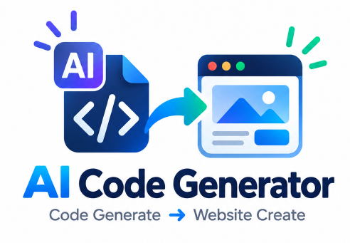
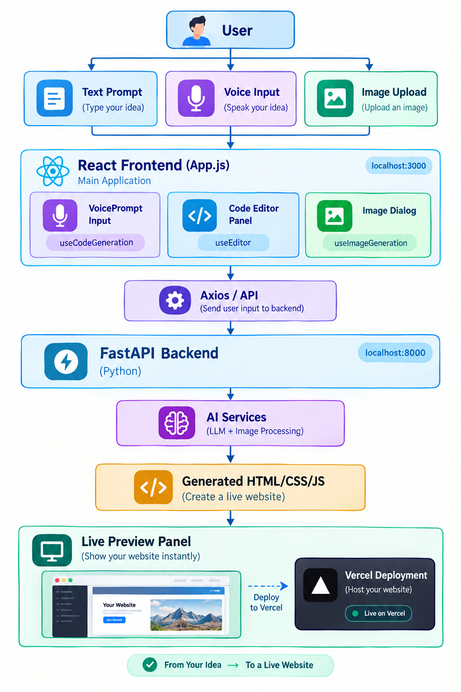

<p align="center">
  
</p>

<p align="center">

    
  
  
  
  

</p>

---

<h1 align="center"> AI Code Generator – Frontend </h1>


A modern **React.js frontend** for an AI-powered code generation platform.


AI Code Generator is an AI-powered web development platform that allows users to create complete websites using simple natural-language **text prompts, voice input, and images**.  
Users can generate, edit, preview, modify, and deploy websites without writing everything manually.

The AI generates the website code, which can then be edited and previewed directly in the application.

**Author:** [Gajanan Deshmukh](https://github.com/Gajanand1219)





### ✨ Key Features

-  **AI-Powered Website Generation**: Create modern websites and components using natural language prompts.
-  **Voice-to-Code**: Describe your ideas using voice and generate website code effortlessly.
-  **Image-to-Website**: Upload UI screenshots or images and transform them into functional website layouts.
-  **Live Code Editor & Preview**: Edit generated code and see real-time website previews in an interactive.
-  **AI Code Assistant**: Modify, debug, refactor, analyze, and optimize code using AI-powered assistance.
-  **Project Management & Deployment**: Save and manage projects, then deploy generated websites to Vercel. Deploy generated websites to Vercel

---


## ! Problem Statement

Building a complete website from scratch can be time-consuming and requires knowledge of HTML, CSS, JavaScript, responsive design, debugging, and deployment.

Developers and beginners often face challenges such as:

-  Spending too much time writing repetitive frontend code
-  Requiring strong technical knowledge to build websites
-  Finding and fixing frontend bugs manually
-  Converting ideas or UI designs into working websites
-  Making multiple changes and improvements manually
-  Implementing responsive designs for different devices
-  Deploying the final website requires additional steps

Traditional development requires users to move between different tools for coding, testing, debugging, and deployment.

---

##  Solution

**AI Code Generator** provides an AI-powered development environment that combines website generation, code editing, live preview, modification, and deployment in one platform.

Users can simply describe what they want in natural language, and the AI generates a functional website automatically.

---

# 🎤 Voice Input

Users can also give website instructions using their **microphone**.

```text
🎤 Voice Input
      ↓
🗣️ Speech to Text
      ↓
💬 User Prompt
      ↓
🤖 AI Website Generation
      ↓
🌐 Live Website
```

The project uses the **Web Speech API** for voice recognition.

---

# 🖼️ Image to Website

Users can upload a **website screenshot** and generate a similar website using an AI Vision model.

```text
📸 Website Screenshot
          ↓
📤 Upload Image
          ↓
👁️ AI Vision Model
          ↓
💻 Generate Website Code
          ↓
🌐 Live Preview
```

The AI analyzes the uploaded screenshot and generates the required **HTML, CSS and JavaScript** code.

```
```

The AI analyzes the image and generates a similar website.
   Website Screenshot          ↓  Upload Image          ↓  AI Vision Model          ↓  Website Code          ↓  Live Preview   `

##  Technologies Used

*   **Backend**: FastAPI, Uvicorn, OpenAI SDK, Pydantic.
*   **Frontend**: React, CSS3, JavaScript (ES6+).
*   **AI**: GPT-4, Claude 3, Gemini Pro.

---

📂 Project Structure
--------------------

```text
AI-Code-Generator/
│
│── frontend/
│   └── my-app/
│       │
│       ├── public/                         # Static public assets
│       │
│       ├── src/
│       │   │
│       │   ├── components/                # Reusable UI components
│       │   │   ├── AppFooter.js            # Application footer
│       │   │   ├── CodeEditorPanel.jsx     # Code editor and code actions
│       │   │   ├── constants.js            # App constants and configuration
│       │   │   ├── ImageToWebsiteDialog.js # Image-to-website generation dialog
│       │   │   ├── LivePreviewPanel.jsx    # Live website preview
│       │   │   ├── ProjectsDialog.js       # Project save/load/delete dialog
│       │   │   ├── SettingsAndHistory.jsx  # Settings and generation history
│       │   │   ├── useSpeechRecognition.js # Voice-to-text functionality
│       │   │   └── VoicePromptInput.jsx    # Text and voice prompt input
│       │   │
│       │   ├── hooks/                     # Custom React hooks
│       │   │   ├── useCodeGeneration.js    # AI code generation and modification
│       │   │   ├── useEditor.js            # Editor state and actions
│       │   │   ├── useImageGeneration.js   # Image-to-website generation logic
│       │   │   └── useProjects.js           # Project management logic
│       │   │
│       │   ├── App.js                     # Main application component
│       │   ├── App.css                    # Main application styles
│       │   ├── index.js                   # React application entry point
│       │   └── index.css                  # Global CSS styles
│       │
│       ├── package.json                   # Frontend dependencies and scripts
│       ├── package-lock.json              # Locked dependency versions
│       └── README.md                      # Frontend documentation
```


##  Installation & Setup

Follow these steps to get the project running locally:
### 1. Clone

```bash
# git clone https://github.com/thepradip/SQL-AI-Agent.git
cd code_assicent
``` 

### 2. Backend Setup (Python)

1.  **Navigate to the backend directory**:
    ```powershell
    cd backend
    ```

2.  **Create a virtual environment**:
    ```powershell
    python -m venv venv
    ```

3.  **Activate the virtual environment**:
    ```powershell
    venv\Scripts\activate
    ```

4.  **Install dependencies**: > The first installation may take some time.
    ```powershell
    pip install -r requirements.txt
    python.exe -m pip install --upgrade pip
    ```
   

5.  **Environment Variables**:
    Ensure you have a `.env` file in the `backend/` 
 (*All ready Api Key Set*)   

6.  **Run the server**:
    ```powershell
    uvicorn main:app --reload
    ```

### 3. Frontend Setup (React)

1.  **Navigate to the frontend directory**:
    ```powershell
    cd frontend/my-app
    ```

2.  **Install dependencies**:
    ```powershell
    npm install
    ```

3.  **Start the development server**:
    ```powershell
    npm start
    ```

The application will typically be available at `http://localhost:3000`.

---
   

<!-- 👨‍💻 Developer -->
### Developer 
---------------

***Gajanan Deshmukh***  **AI Engineer | GenAI Developer**

> Build websites faster with AI — Generate, Edit, Preview & Deploy. 

---

## License

MIT License - [Gajanan Deshmukh](https://github.com/Gajanand1219)

